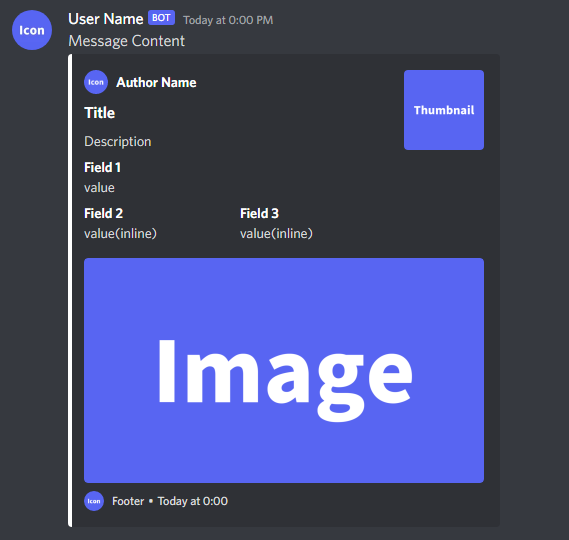

# php-discord-webhook

<table>
    <thead>
        <tr>
            <th style="text-align:center">
                <a href="README.md">日本語</a>
            </th>
            <th style="text-align:center">
                <a>English</a>
            </th>
        </tr>
    </thead>
</table>

Easily send Discord Webhooks.



## Install

```bash
composer require ablaze/php-discord-webhook
```

## Use

Use the sample code as a reference.

[sample/README.md](./sample/)
